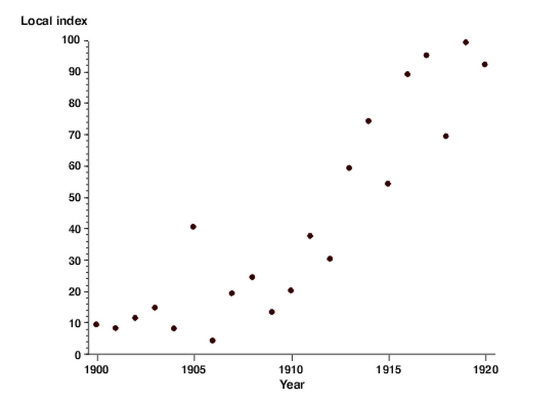
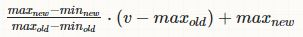
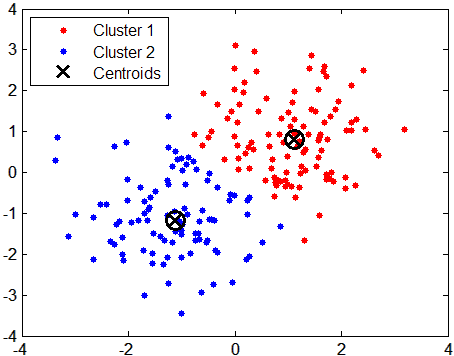
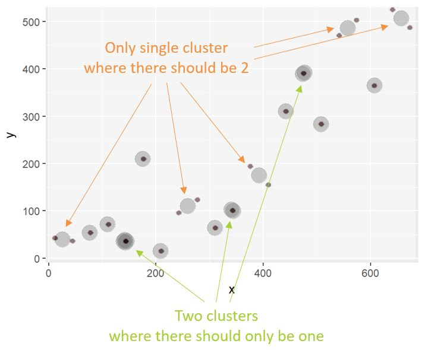

```{r opts, echo = FALSE}
knitr::opts_chunk$set(
  fig.path = "images/"
)
```

```{r echo = FALSE}
# Need to load this to include images
library(knitr)
```


**Overview**: This post will walk you through how to import a scatter plot image into R, explain how R stores image data and how you can access and manipulate it, walk you through using clustering to detect point in the scatter plot image, and compare different forms of regression to see which one fits the scatter plot best.  
**Reading time**: 45 minutes  
**Expertise level**: 3/5  


***


### The challenge

Imagine some co-workers send you this old image of a scatter plot, without any other information, and ask you to help them figure out what type of regression best fits the data.

```{r out.width = '60%', fig.align = 'center', echo = FALSE}

```

<div style="text-align: center;">
Source: [betterevaluation](https://www.betterevaluation.org/evaluation-options/scatterplot)
</div>

Your first reaction might be to extract the values manually with a quick square or something of the sort. But your co-workers tell you they'll send you few more of these your way. And, although the work with the quick square might take you back to your middle school days, you want to figure out if you can do the whole process in a more automated way... Yep, that story is a little weak, but go with it. I promise won't regret it (famous last words). In any case...  

**R to the rescue!!**  

I'm going to show you how you can do all of this in R. And along the way, you might learn a bunch of stuff about pipes, images representations, arrays, data munging, regression, even how a scene from Rocky IV is a great way to think about certain clustering methods. I hope you enjoy it!  


### First steps

##### Loading libraries

The first step is always to import all the necessary libraries.  

* I use the *tidyverse*, the ultimate data wrangling framework, pretty much in every project I work on
* The *magick* and *EBImage* libraries are for image loading and processing
* The *cluster* library is for advanced clustering

```{r load_libraries, message = FALSE, warning=FALSE}
library(tidyverse)
library(magick)
library(EBImage)
library(cluster)
```


##### Quick note on pipes

Although I don't get very fancy with the data wrangling and the tidyverse, I do use pipes (%>%) a whole lot. For those that are not familiar with them, pipes take the result from an operation and use it as the first argument of the following operation.  

In the following example, I pipe 'rogue' into the paste function (which pastes, or concatenates, 2 strings together) to paste it with 'data', and then pipe that result into a paste function with 'science'. The final result is 'rogue data science.' This is the exact same thing as nesting all of them together. It is just much more readable.

```{r pipes}

a <- 'rogue'
b <- 'data'
c <- 'science'

# Pasting with pipes
a %>%
    paste(b) %>%
    paste(c)

# Same result as pasting with nested functions
paste(a, paste(b, paste(c)))

```


##### Piping resources

If you want to get more familiar with pipes, here are a couple of resources:  
* Quick overview: http://blog.revolutionanalytics.com/2014/07/magrittr-simplifying-r-code-with-pipes.html
* More complete introduction: https://www.datacamp.com/community/tutorials/pipe-r-tutorial


### Image loading and data representation

##### Loading images with magick

Now we're all set to start. We'll load the scatter plot image with the magick library's *image_read* function. Although you could crop out the unnecessary parts of the image within R, I did it manually, for the sake of brevity.      

```{r out.width = '100%', fig.align = 'center', echo = FALSE}
include_graphics('image_trimming.JPG')
```

For those that are interested in how magick represents an image in R (the structure of the data), we can quicky inspect the new object with the *str* function.

```{r read_image, size = 'small'}
# https://www.betterevaluation.org/evaluation-options/scatterplot
# Load image into img object
img <-
    image_read('random_scatterplot_trimmed.jpg')

# Look at the structure of the img object
str(img)
```

We don't get a whole lot of information back, but this does tell us that magick image object is simply an external pointer (<externalptr>). This means that R is creating a temporary file (on your computer's hard drive) and it is pointing to that file as the image remains loaded. This is different from other R data structures which are stored on your computer's memory (its RAM). Using some of the hundreds of megabytes of your hard drive is actually how some packages (such as bigmemory) deal with data that is bigger that the available memory. But I digress...  


##### Converting images to data with EBImage

Although magick is great for loading images, the EBImage library is great for manipulating those images. What's great is that magick actually has a function that converts magick objects into EBImage objects: *as_EBImage*.  

Once again, we can look at the structure of the object to better understand it and also the *class* function to specifically see what type of object it is.

```{r jpg_str}
# Convert the magick image object into an EBImage object
# and overwrite the old img object with the new one
img <-
    img %>%
    as_EBImage()

# See structure
str(img)
```

So an EBImage object (of Image class), which unlike magick is contained within the R environment (it's not a pointer), contains 2 elements: the data (an array representation of an image) and a colormode.  


##### Array representation of images

The array representation of the image is what we are really interested in. The dimension of this array are 684 (width) x 542 (height) x 3 (rgb). For those that are not super familiar with matrices and arrays, think of this as an Excel file with 3 sheets, and where each sheet, has 684 columns and 542 rows.  

```{r out.width = '90%', fig.align = 'center', echo = FALSE}
include_graphics('excel_array.JPG') 
```

Here is a great visualization of what an array representation of an image is.   

```{r out.width = '70%', fig.align = 'center', echo = FALSE}
include_graphics('rgb_arrays.jpeg') 
```

<div style="text-align: center;">
Source: https://www.mathworks.com/help/matlab/creating_plots/image-types.html
</div>

As you can see, for each pixel in an image, there is a value for each red, green and blue channels. Here is more detailed information on the rgb color model: https://en.wikipedia.org/wiki/RGB_color_model.   


##### Note on image transparency

One more note on image array representation. While some images, like .jpg, simply have rgb information, other image types, like .png, can also have information about the transparency of the image (the little white and light grey in Google images represent transparency). This When you import a png image, there is an additional transparency channel: the alpha channel (these images are said to have an rgba color space). To see how this works, let's load this free Superman logo from the web and look at its structure (yep, you can load images, and any other file, really, directy from the web as long as you have an internet connection and permission):  

```{r out.width = '80%', fig.align = 'center', echo = FALSE}
include_graphics('superman_logo.JPG')
```

<div style="text-align: center;">
Source: http://www.freepngimg.com/download/superman_logo/2-2-superman-logo-png-file.png
</div>


```{r png_str, size = 'small'}
# Read image from the web (as magick object)
image_read('http://www.freepngimg.com/download/superman_logo/2-2-superman-logo-png-file.png') %>%
    # Convert into EBImage
    as_EBImage() %>%
    # See structure
    str()

# Notice that we are not saving an object but rather feeding the converted web image
# directrly into the structure function
```

You can see from the *str* results that the logo is 3001 x 2252, and now, in addition to the 3 rgb dimensions, there is a 4th dimension (a 4th sheet on in the Excel file) the representing transparency of each pixel.  

Now that we know how images are loaded and represented, let's try to make sense of the data and get it in a format that we can use.


### Data reshaping

##### Choosing a single channel

Instead of trying to make sense of all channels, for the purpose of this excercise, we are simply going to choose one, the red channel. By only selecting a single channel, the resulting data is a matrix, which is a special kind of array that simply has 2 dimesional. Going back to the Excel analogy, we are getting rid of 2 of the 3 sheets.  


```{r image_to_matrix, size = 'small'}

# From the img object, grab the .Data component (the @ here is exacly the same a the $)
# And select all of the items from the first 2 dimension
# and only the first item from the 3rd dimension 
image_mat <-
    # Blanks within the brackets means everything
    img@.Data[, , 1]

# See structure
str(image_mat)

# See class
class(image_mat)

```

The structure of the object confirms it is now a 2-dimensional object. The class confirms that it is no longer an EBImage object but rather a native R matrix. This is exactly what we were looking for. Sweet.  


##### Building analogy for arrays and matrices

If you're still having trouble understanding what we are doing, this might help. Think about being in a three story building. Inside each of the floors, you can move wherever you want and you can even go a floor and stand in the exact same place as in the floor below. So you have a lot of horizontal movement, and are somewhat flexible in terms of vertical movement (one of 3 stories). Suddenly, the top 2 floors close down for repairs. Now you are completely limited to horixontal movement. So the 3 story building is like an array, and a single floor within that building is a matrix. Hope that clears things up. :)


##### From a matrix to a dataframe

The next step is to get the data into a data frame, the best format for data munging and modeling. By simply converting the data into a data frame, although we do in fact get a data frame, it is not in the right shape. We can see this by using the *dim* function, which outputs the dimensions of an object.

```{r matrix_to_dataframe}

# Convert image_mat (a matrix) into a data fram
image_df <-
    image_mat %>%
    as.data.frame()

# See dimensions of image_df
dim(image_df)
```

This data frame had 684 rows and 542 colums. This makes sense because we simply converted the image_mat without any other manupulation, so we can expect the result to be the same shape. But remember that our end product is to get a scatter plot, for which we can only have 2 colums: one with a value for x and another with a value for y.  


##### From wide form to long form

Still, all of the data we need is there, except it is not stores in the actually values within the data frame, but rather in the names of its columns and its rows: the row names represent the x variable position and the variable names represent the y variable position (R has added a "V"" to the beginning of the column names because columns, like the names of other R objects, should not have or start with numbers), and the actual value represents the red color value of the pixels. So the red value for the pixel with coordinates x = 1 and y = 1 is 1:

```{r first_pixel}

image_df[1, 1]

```

So the next step is to reshape this data and convert it into into a 3-variable data frame: x positon, y position, and the value for that pixel.  

**Advanced note:** For those of you that have worked with matrices, this is exactly how low-density matrices (matrices with a lot of zeros) are represented. Only the elements of these matrices that have a value other than 0 are recorded.  

This type of data conversion is called wide format (where there are many variables typically measuring the same thing - in this case pixel colors) to long format (where the variable names are stored in a variables and the other values are stored in another variable). Let's go ahead and do this tranformation.

``` {r final_structure}

# Convert image_df from wide to long format
image_df <-
    image_df %>%
    # Convert the rownames of the data into a variable
    rownames_to_column() %>%
    # Rename this new variable which represents the x values
    rename(x = rowname) %>%
    # This new variable is a string so we have to convert to numeric
    mutate(x = as.numeric(x)) %>%
    # Convert all variables other than the x into long form
    gather('y', 'pixel_value', everything(), -x) %>%
    # Fix the y values
    mutate(y =
               y %>%
               # Remove the V
               str_replace_all('V', '') %>%
               # Convert to numeric
               as.numeric())

# See the top rows
head(image_df)

```

Awesome. That did the trick.  

Now, to finalize the data, we need to make sure we only include the pixel values that actually interest us: those containing the points of the scatter plot.  


### Finalizing data

##### Visualizing pixels with a histogram

To determine how to adequately choose the pixels of interest, we can view the values of these pixels in a histogram and see how they are distributed. We can preemtively filter out any value equal to 1, which are the white pixels (full red, green and blue result in white, while having all values at 0 results in black). We'll use ggplot's *geom_histogram* for the graph.

``` {r pixel_histogram, fig.height = 4.5, fig.width = 6, fig.align = 'center'}

# Plot pixel_value histogram
image_df %>%
    # Use filtering functionality of data frame to remove all 1s (white pixels)
    filter(pixel_value < 1) %>%
    # Visualize in histogram of pixel_values
    ggplot(aes(pixel_value)) +
    geom_histogram(bins = 50)


```

From the histogram, we can tell that there are more than just pure white values (where red is equal to 1), and that the values we are interested in probably lie between 0.1 and 0.25. But to make sure we don't miss anything and since ther is such a big gap between the values of the dark pixels and those of the light ones, we can make 0.5 our cut point.

``` {r filter_pixels}

image_df <-
    image_df %>%
    # Filter 
    filter(pixel_value < 0.5)

```

Now we should be all set. The next step it to actually take a look at the scatter plot we are trying to replicate.


### Visualizing the data

##### First peak at the scatter plot

Now that the data is finalized, at the structure of the data and the shoice of pixels, we can use ggplot's *geom_point* to view the scatter plot. 

```{r initial_scatter_plot, fig.height = 4.5, fig.width = 6, fig.align = 'center'}

image_df %>%
    ggplot(aes(x = x, y = y)) +
    geom_point()

```

If we compare this scatter plot to the original one we loaded, it seems to be upside down. This is becuase the array representation the image flips the image within the data structure. I am not 100% sure why that is, but I am sure it has some purpose.  


##### Final touches: flipping and scaling

Either way, it's an easy fix. All we need is to flip the points. To do so, we just have to mutpliy the y values by -1, which flips the data, and add the difference of the biggest positive and negative points, which corrects the negative values that resulted from the flip.  

The other wuick change we have to make is to make sure that the scales of the x and the y are the same as the original plot. Eyeballing it, the y values seem to range from a 4 to a 98, and the x from 1900 to 1920. In order to rescaled the x and the y, we have to perform the following calculation:

<div style="text-align: center;">
```{r out.width = '50%', fig.align = 'center', echo = FALSE}

```
</div>

Source: https://stats.stackexchange.com/questions/25894/changing-the-scale-of-a-variable-to-0-100

```{r corrected_scatter_plot, fig.height = 4.5, fig.width = 6, fig.align = 'center'}

min_x_new <- 1900
max_x_new <- 1920
min_y_new <- 4
max_y_new <- 98


image_df <-
    image_df %>%
    
    # First flip the points
    mutate(new_y = y * (-1)) %>%
    mutate(new_y = new_y + (max(y) - max(new_y))) %>%
    select(-y) %>%
    rename(y = new_y) %>%
    
    # Then rescale the values
    mutate(x =
               ((max_x_new - min_x_new) / (max(x) - min(x))) *
               (x - max(x)) + max_x_new,
           y =
               ((max_y_new - min_y_new) / (max(y) - min(y))) *
               (y - max(y)) + max_y_new)

image_df %>%
    ggplot(aes(x = x, y = y)) +
    geom_point()

```

Perfect. Onto the next part! :)  


### Clustering

Although we got the data in the shape that we want it, we still have a problem with the points. We want each point on the scatter plot to be represented by a single point in the data. Right now, we have multiple points, which makes sense since, in the image, each point is made up of multiple pixels.  

Clustering to the rescue! Specifically, k-means clustering to the rescue!  

##### k-means clustering overviews

For those that are not familiar with clustering, I was going to do a brief overview of k-means clustering, but there are so many great sources already out there, that pointing you towards them is probably more efficient. So before moving forward, I recommend the following sources:  
* Non-mathy overview: http://www.dummies.com/programming/big-data/data-science/data-clustering-with-the-k-means-algorithm/
* More technical overview: https://www.datascience.com/blog/k-means-clustering

While most of the times one uses k-means clsutering, there is a bit of guesstimation as to how many clusters to look for (although there are also ways finding the optimal number of clusters), we actually know exactly how many clusters we are looking for: 21, the number of points in the scatter plot. This makes the algorithm super easy to run.  


##### Using k-means for its centroids

Once we have the results, all we have to do is extract the centroids of the clusters. These are simply the central points (more specifically, the centers of mass) of each of the groups.  

```{r out.width = '50%', fig.align = 'center', echo = FALSE}

```

<div style="text-align: center;">
Source: http://mines.humanoriented.com/classes/2010/fall/csci568/portfolio_exports/mvoget/cluster/cluster.html
</div>

For those familiar with the Rocky movies, using the centroids here is the equivalent of "hit the one in the middle!"   

<div style="text-align: center;">
<iframe width="560" height="315" src="https://www.youtube.com/embed/NHxUgYWcufo?rel=0" frameborder="0" allowfullscreen></iframe>
</div>

Movie reference: check!  

```{r kmean_scatter_plot, fig.height = 4.5, fig.width = 6, fig.align = 'center'}

# Set a random seed so that the resutls are the same everytime
set.seed(1)

# Run the k-means algorithm on the x and y values of the data
kmeans_fit <-
    kmeans(
        # We won't need the whole dataframe, just the x and y values
        x =
            image_df %>%
            select(x, y),
        # We set the number of clusters to look for to 21
        centers = 21)

# Extract the centroids from the results as a dataframe
simplified_df <-
    kmeans_fit$centers %>%
    as_data_frame()

# Plot the centroids in a scatter plot
simplified_df %>%
    ggplot(aes(x = x, y = y)) +
    geom_point(size = 6, alpha = .4)

```


##### When k-means fails: the pam algorithm

The k-means clustering did a really good job. Almost exactly what we wanted, but not quite. Let's overlay the original scatter plot onto this new one to see where there are discrepancies (not supper pretty, but it does the job).

```{r out.width = '60%', fig.align = 'center', echo = FALSE}

```

So k-clustering did not recognize the right clusters. Luckily, there is another clustering algorithm developed precisely for when k-means fails: the pam, or partitions around medioids, algorithm (https://www.r-bloggers.com/when-k-means-clustering-fails/). The *cluster* library has a great implementation of pam.

```{r pam_scatter_plot, fig.height = 4.5, fig.width = 6, fig.align = 'center'}

# To run pam, we use the exact same arguments as with kmeans
pam_fit <-
    cluster::pam(x =
               image_df %>%
               select(x, y),
           k = 21)

# Extract the medioids from the results as a dataframe
simplified_df2 <-
    pam_fit$medoids %>%
    as_data_frame()

# Plot the medioids in a scatter plot
simplified_df2 %>%
    ggplot(aes(x = x, y = y)) +
    geom_point(size = 6, alpha = 0.4)

```

It seems like it did a better job. But to make sure, let's overlap the original scatter plot onto this new one once again.

```{r out.width = '60%', fig.align = 'center', echo = FALSE}
include_graphics('cluster_analysis2.JPG')
```

Sweet! That worked perfectly.


### Regression

We got our data ready and we've made sure it matches the original scatter plot. Now all we have to do is see which regression fits the data best.  


##### Eyeballing the regressions

The first thing we can do is a good old eye test. Using the ggplot stat_smooth function, we can plot both a linear regression and a quadratic. Here is a pretty good and simple overview of these different regression types: http://blog.minitab.com/blog/adventures-in-statistics-2/curve-fitting-with-linear-and-nonlinear-regression.

```{r regressions_scatter_plot, fig.height = 4.5, fig.width = 6, fig.align = 'center'}

# Plot the scatter plot with the linear and quadratic regression lines
simplified_df2 %>%
    ggplot(aes(x = x, y = y)) +
    
    # First plot the simple linear regression
    stat_smooth(method = 'lm',
                # The function of a linear regresion is y = a + bx
                formula = y ~ x,
                # This removes the confidence interval plot
                se = FALSE,
                # Color of the line
                col = 'deepskyblue2',
                # 20% alpha (or 80% transparency)
                alpha = 0.2,
                # Width of the line
                size = 2) +
    stat_smooth(method = 'lm',
                # The function of a linear regresion is y = a + b1x + b2x^2
                formula = y ~ x + I(x^2),
                se = FALSE,
                col = 'forestgreen',
                alpha = 0.2,
                size = 2) +
    # Add the scatter plot
    geom_point(size = 6, alpha = 0.4)

# Note that I first plotter the regression lines and the the scatter plot.
# This is simply to have the lines in the "background" of the graph
# but you can do it whichever way you prefer.

```

Based on the graph, it seems like the quadratic is a slightly better fit, especially at the edges of the curves. But it's close enough where we would probably want to make sure.  


##### The ultimate regression verdict: r-squared

To do so, we can run the two different regressions and compare their r-squared results. If you're not familiar with r-squared, it is a very common measure for determining how well a regression fit. It is typically interpreted and the percent of variability of the dependent variable (y in this case) that can be explained by the indepent variable or varibles (in the case there is more than 1). The higher the r-squared the better. Once again, if you want a little more information about this topic, here is a pretty good and simple explanation: http://blog.minitab.com/blog/adventures-in-statistics-2/regression-analysis-how-do-i-interpret-r-squared-and-assess-the-goodness-of-fit.

```{r regression_summaries}

# First we run the linear regression (with the same formula as in the ggplot graph)
linreg_fit <-
    lm(y ~ x, data = simplified_df2)

# Second we run the quadratic regression (also with the same formula as in the ggplot graph)
quadreg_fit <-
    lm(y ~ x + I(x^2), data = simplified_df2)

# Now we can return the r-squared.
# We can do this in a more fancy manner with the message function
message(
    paste('Linear regression r-squared:',
          # Get the r-squared element from the summary of the fit
          summary(linreg_fit)$r.squared)
)

message(
    paste('Quadratic regression r-squared:',
          # Get the r-squared element from the summary of the fit
          summary(quadreg_fit)$r.squared)
)

```

This proves what we concluded from the graph: the quadratic is a better fit. It explains 86% percent of the variability of the dependent variable, while the linear regression only explained 80%, which is still pretty good.

Awesome, we're all done. Hope you enjoyed it and learned a few new things. Please reach out if you have any questions.  

Cheers!
